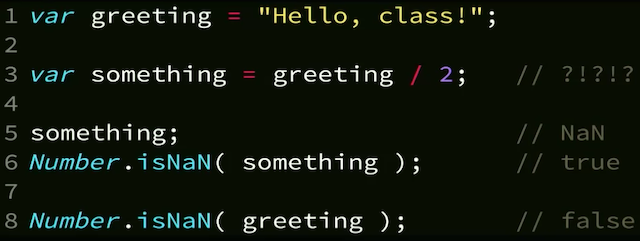

# Getting started with Javascript

## Three Pillars of JS

### Types & Coercion

1. Primitive Types
2. Converting Types
3. Checking Equality

#### Primitive Types

1. undefined
2. string
3. number
4. boolean
5. object
6. symbol
7. null?

> In Javascript, variables don't have types, values do.

#### NaN

NaN doesn't really mean Not a Number, it means we have an invalid numeric operation in some sort.

#### New

